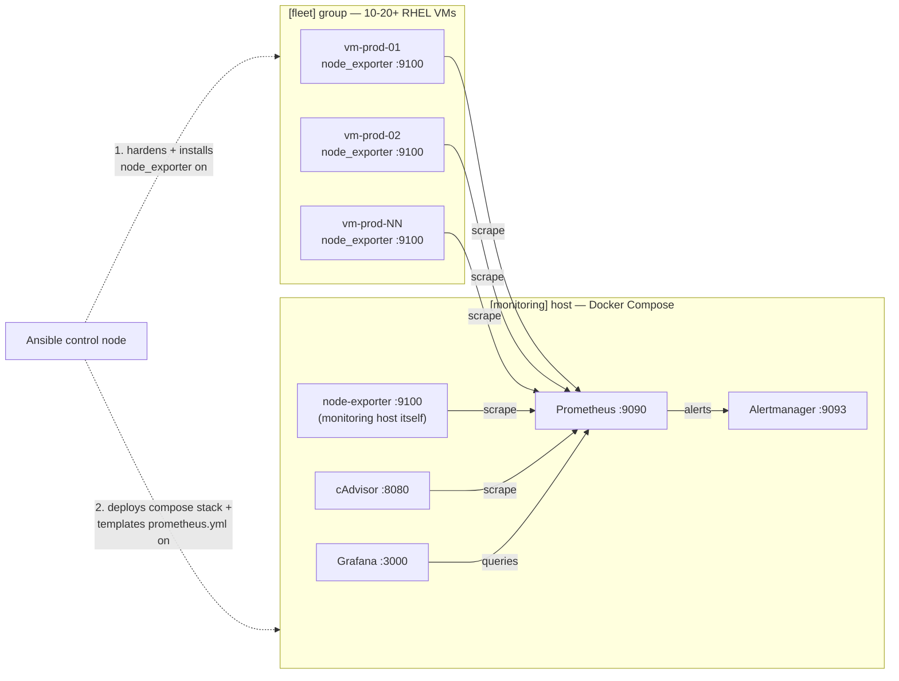

# fleet-monitoring-stack


A containerized Prometheus/Grafana/Alertmanager monitoring stack, deployed
and kept in sync across a fleet of 10-20+ RHEL VMs by Ansible. Add or remove
a VM from inventory, re-run the playbook, and Prometheus's scrape targets
update automatically — no manual config edits on the monitoring server.

Built as a companion to [linux-audit-toolkit](https://github.com/blow-tech/linux-audit-toolkit):
that project audits individual hosts on a schedule; this one gives you a
live, always-on view across the whole fleet.

## What this actually does

- **`docker/`** — a self-contained Docker Compose stack: Prometheus,
  Grafana (pre-provisioned with a Prometheus datasource and a fleet
  overview dashboard), Alertmanager, cAdvisor (container-level metrics for
  the monitoring host itself), and node-exporter (host metrics for the
  monitoring host itself).
- **`ansible/`** — deploys that stack to a dedicated monitoring host, and
  rolls out `node_exporter` + baseline OS hardening to every VM in the
  fleet. The Prometheus scrape config is **templated directly from the
  Ansible inventory** — the `[fleet]` group is the single source of truth
  for which hosts are monitored.

## Architecture



Firewall posture: each fleet VM's `node_exporter` port (9100) only accepts
connections from the monitoring host's IP, via a firewalld rich rule — not
the whole subnet. Grafana/Prometheus/Alertmanager ports on the monitoring
host are scoped to `monitoring_allowed_source_cidr` (default `10.0.0.0/8`,
override per environment).

## Requirements

- Ansible control node: `ansible-core` 2.15+, with collections
  `community.general` and `ansible.posix` (see `ansible/requirements.yml`)
- Managed hosts: RHEL 8/9 or Rocky/Alma, reachable via SSH with sudo
- One host designated as the monitoring server (2 vCPU / 4GB RAM minimum
  for the full stack; more if retaining months of metrics)
- Outbound internet access from the monitoring host (Docker Hub, GHCR) and
  from fleet VMs (GitHub releases, for the node_exporter binary) — or point
  `docker-compose.yml` / the node_exporter role at an internal registry/mirror

## Quick start

```bash
git clone https://github.com/blow-tech/fleet-monitoring-stack.git
cd fleet-monitoring-stack/ansible

ansible-galaxy collection install -r requirements.yml

cp inventory/hosts.ini inventory/hosts.ini.local
# edit inventory/hosts.ini.local with your real monitoring host + fleet VMs

# Set a real Grafana admin password instead of the placeholder in
# group_vars/all.yml — see "Secrets" below.

ansible-playbook -i inventory/hosts.ini.local playbook.yml --check --diff   # dry run
ansible-playbook -i inventory/hosts.ini.local playbook.yml                  # apply
```

Then open `http://<monitoring-host>:3000` (Grafana) and check the **Fleet**
folder for the pre-provisioned "Fleet Overview" dashboard.

## Secrets

`grafana_admin_password` in `group_vars/all.yml` is a plaintext placeholder
— **replace it before running against real infrastructure.** Use
`ansible-vault`:

```bash
ansible-vault encrypt_string 'YourRealPassword123!' --name 'grafana_admin_password'
```

Paste the resulting block into `group_vars/all.yml` (or a separate
`group_vars/vault.yml` you `ansible-vault encrypt` wholesale), then run the
playbook with `--ask-vault-pass` or `--vault-password-file`.

The same applies to `baseline_admin_users[].password_hash` — generate real
hashes with:
```bash
python3 -c "import crypt; print(crypt.crypt('changeme', crypt.mksalt(crypt.METHOD_SHA512)))"
```
and vault them the same way. Never commit real password hashes or the
Grafana password in plaintext.

## Scaling the fleet

Ansible's host-range syntax means growing from 10 to 200 VMs is a one-line
inventory edit, not manual entry:

```ini
[fleet]
vm-prod-[01:20].example.local
```

Re-running `ansible-playbook` after editing this line will install
node_exporter + firewall rules on any newly-added hosts, then update
`prometheus.yml` on the monitoring host to start scraping them —
all in one run.

## What common_baseline actually changes on every host

- Timezone + NTP (chrony)
- Admin user accounts (from `baseline_admin_users`) with SSH key auth
- SSH hardening: root login disabled by default; password auth disable is
  **opt-in** (`baseline_disable_ssh_password_auth: false` by default) so a
  first run can't lock you out before you've confirmed key-based access
- fail2ban on sshd (5 attempts / 10 min → 1hr ban)
- firewalld enabled with a default-deny posture beyond explicitly opened
  services
- SELinux confirmed enforcing (warns, doesn't silently disable, if not)
- `dnf-automatic` for unattended **security-only** patching
- A managed MOTD banner

Every one of these is a variable in `inventory/group_vars/all.yml` — read
it before your first production run.

## Manual / standalone use of the Docker stack

You don't need Ansible to try the stack locally:

```bash
cd docker
cp .env.example .env    # set a real GRAFANA_ADMIN_PASSWORD
docker compose up -d
```

Grafana: `http://localhost:3000` · Prometheus: `http://localhost:9090` ·
Alertmanager: `http://localhost:9093`. The bundled `prometheus.yml` has
placeholder fleet targets — edit it directly for standalone use, or use
the Ansible role for the real templated version.

## Notes / limitations

- **Test in a non-prod environment first**, especially the SSH-hardening
  and firewalld tasks in `common_baseline` — a misconfigured rule or a
  premature password-auth disable can lock you out of a host.
- The `node_exporter` role downloads and checksum-verifies the binary from
  GitHub releases at playbook run time. For air-gapped or change-controlled
  environments, mirror the binary internally and point
  `node_exporter_install_dir`/download URL at your mirror instead.
- Alertmanager ships with a `null` receiver (drops all alerts) by default —
  wire up a real receiver (Slack, email, PagerDuty, etc.) in
  `docker/alertmanager/alertmanager.yml` before relying on this for
  incident response.
- The bundled Grafana dashboard is a compact, original 8-panel overview —
  not a copy of any community dashboard. Import additional dashboards from
  [grafana.com/dashboards](https://grafana.com/grafana/dashboards/) as
  needed (e.g. the community Node Exporter Full dashboard) via Grafana's UI
  or by dropping exported JSON into `docker/grafana/provisioning/dashboards/json/`.

## License

MIT — see [LICENSE](LICENSE).
