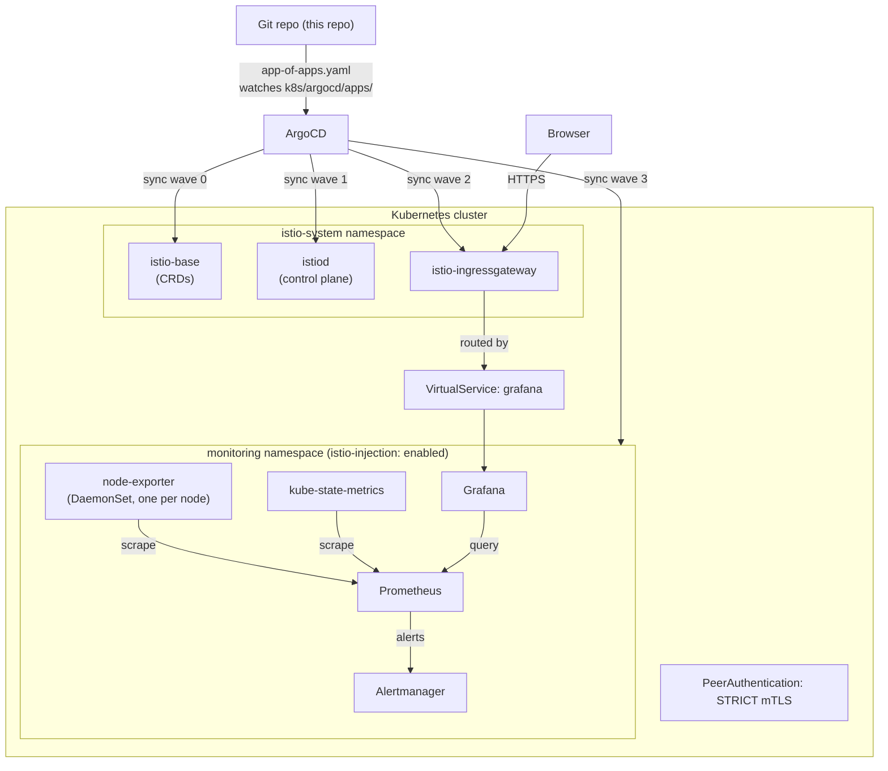

# Kubernetes-native deployment (GitOps + service mesh)

An alternative to the `ansible/` + `docker/` path in the repo root. Same
monitoring goal — Prometheus, Grafana, Alertmanager, fleet-wide metrics —
delivered the cloud-native way instead of the VM/config-management way:

| | VM path (repo root) | This path (`k8s/`) |
|---|---|---|
| Compute | 10-20+ RHEL VMs | Kubernetes cluster |
| Deployment | Ansible playbook run | ArgoCD auto-syncs from Git |
| Config drift | Re-run playbook to reconcile | ArgoCD `selfHeal` reverts it automatically |
| Service-to-service encryption | None (plain HTTP inside the compose network) | Istio STRICT mTLS, cert-rotated automatically |
| "Add a monitored target" | Add a line to `inventory/hosts.ini` | Kubernetes' own service discovery — no inventory to edit |
| Ingress | Firewall rich-rules + direct ports | Istio Gateway + VirtualService, TLS terminated at the mesh edge |

Both paths are real, working options in this repo — pick whichever matches
where you're actually deploying. They are **not** meant to run against the
same environment simultaneously.

## Architecture



## What's actually in here

```
k8s/
├── namespace.yaml                    # monitoring namespace, sidecar injection enabled
├── istio-namespace.yaml              # istio-system namespace
├── argocd/
│   ├── app-of-apps.yaml              # root Application — point ArgoCD at this one file
│   └── apps/
│       ├── istio-base.yaml           # wave 0 — Istio CRDs
│       ├── istiod.yaml               # wave 1 — Istio control plane
│       ├── istio-ingressgateway.yaml # wave 2 — mesh ingress
│       └── monitoring.yaml           # wave 3 — kube-prometheus-stack Helm chart
├── helm-values/
│   └── kube-prometheus-stack-values.yaml   # real overrides: ClusterIP, persistence, retention, resource limits
└── istio/
    ├── peer-authentication.yaml      # STRICT mTLS for the monitoring namespace
    ├── destinationrule-grafana.yaml  # client-side mTLS policy for Grafana
    ├── gateway.yaml                  # external HTTPS entry point
    └── virtualservice-grafana.yaml   # routes Gateway traffic to Grafana
```

**Deliberate choice:** the monitoring stack itself is the community
[`kube-prometheus-stack`](https://github.com/prometheus-community/helm-charts/tree/main/charts/kube-prometheus-stack)
Helm chart, not hand-written manifests. That chart already correctly
handles the Prometheus Operator, CRDs, RBAC, and a maintained alerting
rule library — reinventing it in raw YAML would be worse, not more
"senior." The value this repo adds on top is the **GitOps wiring and the
mesh security policy**, not reimplementing an operator.

## Prerequisites

- A running Kubernetes cluster (1.27+) with `kubectl` access
- [ArgoCD](https://argo-cd.readthedocs.io/en/stable/getting_started/) already installed in the `argocd` namespace
- A cloud LB (EKS/GKE/AKS) or MetalLB if on bare metal, for the Istio ingress gateway's `LoadBalancer` Service
- A TLS cert for `grafana.example.com` (via cert-manager or manually), stored as the `fleet-monitoring-tls` secret in `istio-system`
- A Grafana admin credentials secret, created **before** the `monitoring` Application first syncs:
  ```bash
  kubectl create namespace monitoring
  kubectl create secret generic grafana-admin-credentials \
    --namespace monitoring \
    --from-literal=admin-user=admin \
    --from-literal=admin-password='YourRealPassword123!'
  ```

## Deploy

```bash
# Point the hostnames in k8s/istio/gateway.yaml and
# k8s/istio/virtualservice-grafana.yaml at your real domain first.

kubectl apply -f k8s/argocd/app-of-apps.yaml
```

That's it — the app-of-apps Application watches `k8s/argocd/apps/`, and
each child Application in there deploys itself in the sync-wave order
above. Watch progress with:

```bash
argocd app list
argocd app get fleet-monitoring-app-of-apps
```

## Validated, not just written

`.github/workflows/ci.yml`'s `k8s-manifest-validate` job runs every
manifest in this directory through
[`kubeconform`](https://github.com/yannh/kubeconform) in `-strict` mode
against real upstream Kubernetes/Istio/ArgoCD schemas (via the
[datreeio/CRDs-catalog](https://github.com/datreeio/CRDs-catalog)) on
every push — this catches structurally invalid resources (wrong field
names, bad types), not just YAML syntax errors.

**Not yet validated by CI:** this hasn't been applied against a real
cluster end-to-end — schema validation confirms the resources are
well-formed, not that the full GitOps flow reconciles cleanly against a
live ArgoCD instance. See the main [Roadmap](../README.md#roadmap) for the
plan to close that gap (Molecule-equivalent for this path would be a `kind`
or `k3d` cluster spun up in CI).

## Known simplifications

- `monitoring.yaml`'s Application assumes the Helm release name defaults
  to `fleet-monitoring` (from the Application's own `metadata.name`) — the
  Grafana Service name referenced in `virtualservice-grafana.yaml`
  (`fleet-monitoring-grafana`) depends on this. Confirm the actual release
  name after first sync and adjust if ArgoCD names it differently.
- The Grafana dashboard provisioned in the Docker Compose path isn't
  auto-synced here yet — see the Helm values file's comment on
  provisioning it via a labeled ConfigMap.
- Sync-wave ordering (comments in each Application) is the simple approach;
  a stricter setup would also add ArgoCD `Sync Hooks`/health checks so wave
  N+1 genuinely blocks until wave N reports healthy, not just "synced."
